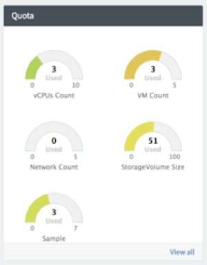
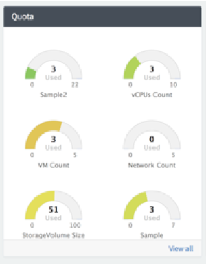

## Additional Custom Quotas Display for Cloud User Portal
###### Solution Category: Enhancement
Display additional quotas on the “Quota” widget of the Cloud User Portal welcome page if custom quotas are added beyond the 4 OOB (out-of-the-box) quotas. The Quota widget OOB is hardcoded to only display 4 quotas; additional quotas are not automatically displayed in this panel. This solution provides an option to display additional quota “dials” in this Quota widget if desired.

##### _Alert: This solution requires the modification of OOB code. Take this into consideration when implementing for upgrade scenarios._

## ServiceNow Release

This solution was initially created on Kingston Patch 7.

## Prerequisites

Jakarta and above Cloud Management (CMP V2) application is activated.

## Installation Steps
##### _Alert: This solution requires the modification of OOB code. It is recommended to take a backup of the current environment before executing the installation steps._

There is one update set to:

1. Modify the following OOB “Cloud Quota Chart” widget design components:
	* HTML Template
	* Link Function

Once the update set has been applied, up to two additional quota “dials” will be displayed in the Quota widget of the Cloud User Portal if at least one additional custom quota is added to the system.

Note: This solution is not 100% dynamic; the HTML template is restricted to a hardcoded, specific number of bootstrap container blocks in a 2x2 layout. Since the tool allows for an X number of quotas to be added to the system, it is recommended to maximize this layout to a total of 6 quota dials and instruct the user to click on the “View all” link at the bottom of the Quota widget to view all the quota details.

Filename: Custom Additional Quotas Display_UpdateSet_vNN.xml

## Documentation

Refer to the Additional Quotas Display_HowToSteps_vNN.pdf document as additional how-to reference on manually configuring this solution.

###### Examples:
###### When a 5th quota is added.

###### When a 6th and 7th quotas are added.

## Disclaimer
This is not an officially supported solution by ServiceNow.

## Authors

* Annie Chan

## Maintainers/Sponsors

Current maintainers:

* [Annie Chan](https://github.com/sn-achan)
